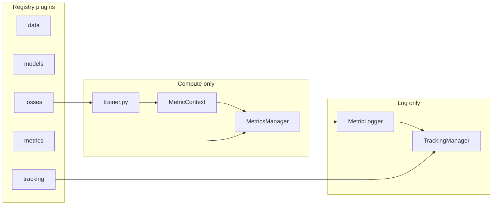

<div align="center">

# ML Classifier Template

[](https://github.com/Solvro/ml-xai-introduction/actions/workflows/python-ci.yml)
[](LICENSE)
[](https://github.com/Solvro/ml-xai-introduction/pulls)


Hydra + registry template for image classification experiments.
Clone, rename with `bootstrap_project.py`, add a model, run training.

*Pull requests and issues are welcome.*

</div>

---

## Introduction

This repo is a practical base for training classifiers on small image datasets. Configuration lives in YAML (Hydra); new components are added as plugins registered with a decorator — you usually do not need to edit `train.py`.

The examples ship with MNIST, Fashion-MNIST, and EMNIST. The same layout should work for your own dataset and model: one Python file, one config file, one CLI flag.

If you are setting up a lab project, run the bootstrap script once to rename the package and trim this README. After that, your work is mostly under `models/` and `conf/model/`.

---

## Stack

| Tool | Role |
|------|------|
| [Hydra](https://hydra.cc/) | Config composition and CLI overrides |
| [PyTorch](https://pytorch.org/) | Models and training |
| [uv](https://docs.astral.sh/uv/) | Dependencies and virtual env |
| Registry (`registry.py`) | Plugin discovery for data, models, losses, metrics, tracking |

---

## Design

- Config overrides from the terminal, e.g. `model=cnn training.epochs=5`.
- A new plugin is typically one module + `@*_registry.register` + a YAML file.
- Three layers: plugins (registry) → compute (`MetricsManager`) → logging (`MetricLogger`, trackers).
- Metrics are chosen per phase: `metrics.train.active`, `metrics.validation.active`, `metrics.test.active`.
- Trackers (wandb, MLflow, TensorBoard) can run alone or together via `TrackingManager`.
- Run outputs go to `outputs/<job>/<experiment>/<timestamp>/`.

## Project Structure

```
├── .github/workflows/       # CI (lint, test, smoke train)
├── conf/                      # Hydra configs
│   ├── data/                     # Dataset plugins (mnist, emnist, …)
│   ├── model/                    # Model plugins (cnn, baseline, …)
│   ├── loss/                     # Loss plugins
│   ├── metrics/                  # Per-phase metric lists
│   ├── logging/                  # Tracker backends
│   ├── training/                 # Optimizer, scheduler, early stopping, export
│   ├── paths/                    # output_dir, checkpoint_dir
│   └── train.yaml                # Root config
├── scripts/
│   ├── bootstrap_project.py      # Rename template → your project
│   └── quality_report.py         # Ruff + pytest + coverage summary
├── src/ml_xai_introduction/
│   ├── data/                     # dataset_registry
│   ├── models/                   # model_registry
│   ├── losses/                   # loss_registry
│   ├── metrics/                  # metric_registry, MetricsManager, MetricLogger
│   ├── tracking/                 # tracking_registry
│   ├── training/                 # trainer, setup, early stopping
│   ├── utils/                    # checkpoints, export
│   └── train.py                  # Entry point
├── tests/
├── .env.example               # WANDB / MLflow secrets (copy to .env)
├── .project-root              # Marker for repo root (used by scripts)
├── CITATION.cff               # Academic citation metadata
├── LICENSE                    # MIT
├── Makefile                   # make train | test | quality | bootstrap
└── pyproject.toml
```

---

## Quickstart

```bash
# clone
git clone https://github.com/Solvro/ml-xai-introduction
cd ml-xai-introduction

# install
uv sync

# optional: rename for your lab/project
uv run python scripts/bootstrap_project.py

# smoke train (offline, 1 epoch)
make train TRAINING_EPOCHS=1

# full quality check
make quality
```

Default run trains MNIST + CNN for 10 epochs with no external loggers.

---

## Bootstrap Your Project

After clone, external groups should rebrand the template once.

**Interactive** (prompts for anything you omit):

```bash
uv run python scripts/bootstrap_project.py
```

**Or pass flags directly:**

```bash
uv run python scripts/bootstrap_project.py \
  --name my-lab-cnn \
  --author "Lab X" \
  --email "lab@uni.pl" \
  --description "EMNIST CNN experiments"
```

**What happens automatically** (no extra step):

- Renames `src/ml_xai_introduction/` → `src/my_lab_cnn/`
- Updates imports, `pyproject.toml`, logging `project_name`, README stub
- **Keeps** `LICENSE` (MIT requirement when redistributing source)
- **Removes** `CITATION.cff` (template citation no longer applies)

Flags:

| Flag | Purpose |
|------|---------|
| `--dry-run` | Show plan, change nothing |
| `--yes` | Skip final `Proceed? [y/N]` prompt |
| `--force` | Run even if git working tree is dirty |
| `--attribution-line` | Optional upstream note in README stub |

---

## Command-line examples

Typical overrides — expand a section to see commands.

<details>
<summary>Override config parameters</summary>

```bash
uv run python src/ml_xai_introduction/train.py training.epochs=20 training.optimizer.lr=3e-4
uv run python src/ml_xai_introduction/train.py data=fashion_mnist model=baseline
```

Add a new key with `+`:

```bash
uv run python src/ml_xai_introduction/train.py +logging.wandb.tags=[baseline,mnist]
```

</details>

<details>
<summary>Switch model, dataset, or loss</summary>

```bash
uv run python src/ml_xai_introduction/train.py model=simple_cnn data=emnist
uv run python src/ml_xai_introduction/train.py model=residual_cnn loss=default
```

Each plugin: `@*_registry.register("name")` + `conf/<group>/<name>.yaml`.

</details>

<details>
<summary>Metrics per phase</summary>

```bash
uv run python src/ml_xai_introduction/train.py \
  metrics.validation.active=[loss,accuracy] \
  metrics.test.active=[loss,accuracy,f1]
```

Empty `active: []` skips computation for that phase.

</details>

<details>
<summary>Experiment tracking</summary>

Copy `.env.example` → `.env` and set `WANDB_API_KEY`.

```bash
uv run python src/ml_xai_introduction/train.py logging=wandb
uv run python src/ml_xai_introduction/train.py logging=tensorboard
uv run python src/ml_xai_introduction/train.py logging.backends=[wandb,tensorboard]
```

Logged keys: `train/*`, `val/*`, `test/*`, `summary/*`, `data/*`.

</details>

<details>
<summary>Early stopping and schedulers</summary>

```bash
uv run python src/ml_xai_introduction/train.py training.early_stopping.enabled=true training.early_stopping.monitor=loss
uv run python src/ml_xai_introduction/train.py training.scheduler.name=step
uv run python src/ml_xai_introduction/train.py training.scheduler.name=reduce_on_plateau
```

</details>

<details>
<summary>Model export</summary>

`.pth` is always written after training. ONNX when enabled:

```bash
uv run python src/ml_xai_introduction/train.py training.export.onnx=true
```

</details>

---

## How It Works



[`train.py`](src/ml_xai_introduction/train.py) orchestrates: load config → tracker → data → model → loss → epoch loop → test → export.

`MetricsManager` never talks to wandb. `MetricLogger` never computes metrics.

---

## Main Config

[`conf/train.yaml`](conf/train.yaml):

```yaml
defaults:
  - hydra: default
  - paths: default
  - logging: default
  - training: default
  - loss: default
  - metrics: default
  - model: cnn
  - data: mnist
  - _self_
```

[`conf/paths/default.yaml`](conf/paths/default.yaml):

```yaml
output_dir: outputs/${paths.job_name}/${logging.experiment_name}/${now:%Y-%m-%d_%H:%M}
checkpoint_dir: ${paths.output_dir}/checkpoints
```

---

## Workflow

1. Write a model in `src/ml_xai_introduction/models/my_model.py` with `@model_registry.register("my_model")`.
2. Add `conf/model/my_model.yaml` with `name: my_model`.
3. Run: `uv run python src/ml_xai_introduction/train.py model=my_model`.
4. Check `outputs/` and your tracker dashboard.

**Do not edit** `train.py` or factory files for a new classifier.

---

## Add Your Classifier

**Contract:**

- `forward(x)` returns **raw logits** `(batch, num_classes)` — not softmax.
- Read `num_classes` from `cfg.data.num_classes`.
- Input shape: `(B, C, H, W)` — MNIST plugins use `C=1`, `28×28`.

**Minimal example** (copy from [`models/cnn.py`](src/ml_xai_introduction/models/cnn.py)):

```python
@model_registry.register("my_cnn")
def build_my_cnn(cfg: DictConfig) -> Model:
    return MyCNN(num_classes=int(cfg.data.num_classes))
```

**YAML** (`conf/model/my_cnn.yaml`):

```yaml
name: my_cnn
```

**Smoke test** (`tests/models/test_my_cnn.py`):

```python
def test_builds_and_forward():
    cfg = OmegaConf.create({"model": {"name": "my_cnn"}, "data": {"num_classes": 10}})
    model = load_model(cfg)
    out = model(torch.zeros(2, 1, 28, 28))
    assert out.shape == (2, 10)
```

---

## Logs

```
outputs/
└── train/
    └── default/                    # logging.experiment_name
        └── 2026-06-24_12:00/       # timestamp
            ├── checkpoints/
            │   └── best.pt
            ├── tensorboard/        # if logging=tensorboard
            ├── cnn_best.pth
            └── ...
```

---

## Experiment Tracking

| Backend | Config | Notes |
|---------|--------|-------|
| none | `logging=default` | Offline / no-op |
| wandb | `logging=wandb` | Set `.env` + `conf/logging/wandb.yaml` |
| mlflow | `logging=mlflow` | `MLFLOW_TRACKING_URI` in `.env` |
| tensorboard | `logging=tensorboard` | Logs under `output_dir/tensorboard` |

Secrets go in `.env` (see [`.env.example`](.env.example)), loaded at startup.

---

## Tests

```bash
uv run pytest -q
uv run pytest tests/models/test_simple_cnn.py -v
uv run pytest -k "not slow" -q
```

CI runs pytest + coverage on every PR.

---

## Quality Report

```bash
make quality
# or
uv run python scripts/quality_report.py
uv run python scripts/quality_report.py --full   # includes smoke train
```

Prints a summary table: ruff lint, format, pytest, coverage.

---

## Continuous Integration

[`.github/workflows/python-ci.yml`](.github/workflows/python-ci.yml):

- pre-commit (ruff, yaml)
- `pytest` with coverage
- smoke train `training.epochs=1 logging=default`

---

## Best Practices

- **Use pre-commit:** `uv run pre-commit install` then `uv run pre-commit run -a`
- **Use `.env`** for API keys — never commit secrets
- **Metric prefixes** — `train/loss`, `val/accuracy` (handled by `MetricLogger`)
- **Don't fork the pipeline** — add plugins, not copies of `train.py`
- **Keep `LICENSE`** when redistributing source (MIT)

---

## Acknowledgements

This template is maintained by Marcel Musiałek, Iga Wolanin, and Damian Ryczko.

If this codebase helped your research, we'd appreciate a mention — **it is not legally required**, but it helps others find the template.

**Suggested places:** paper footnote, thesis acknowledgements, project README, wandb run notes.

**Minimal footnote example:**

> Classification pipeline based on the [ML Classifier Template](https://github.com/Solvro/ml-xai-introduction).

Use [`CITATION.cff`](CITATION.cff) for BibTeX / GitHub "Cite this repository".

---

## Contributions

Open an issue or PR on GitHub. Please run `make quality` before submitting.

Template roadmap (maintainers): [`BACKLOG.md`](BACKLOG.md).

---

## License

**Legal (MIT):** You may use, modify, and distribute this code. If you redistribute **source**, keep the [`LICENSE`](LICENSE) file.

**Courtesy:** If the template helped your project, a shoutout in a paper or README is appreciated.

**Your work:** Your models, weights, and publications are entirely yours.

MIT License — see [`LICENSE`](LICENSE) for full text.

---

**DELETE EVERYTHING ABOVE FOR YOUR PROJECT**

---

# {project_name}

{description}

## Installation

```bash
git clone <your-repo-url>
cd <your-repo>
uv sync
```

## How to run

```bash
uv run python src/{package}/train.py
uv run python src/{package}/train.py model=cnn training.epochs=10 logging=wandb
```
